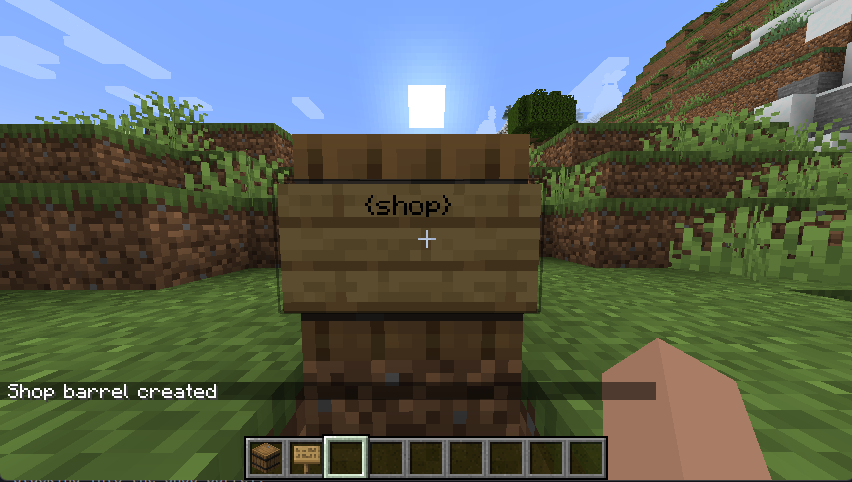
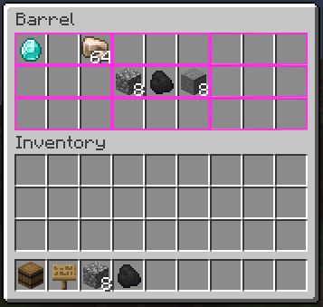
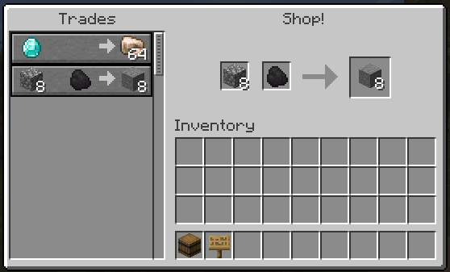
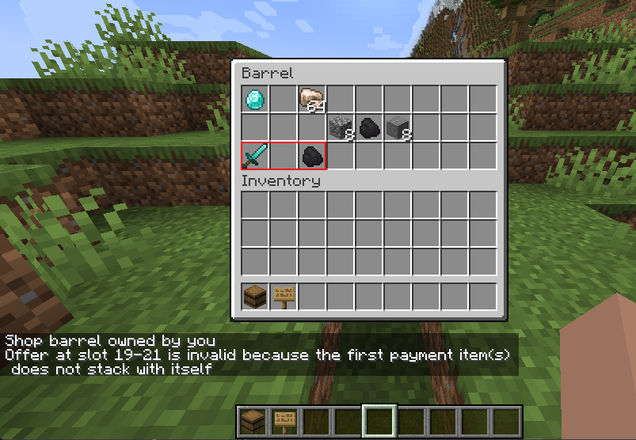
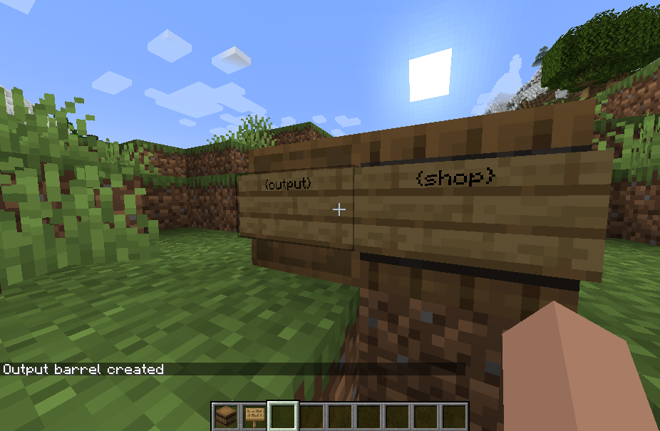
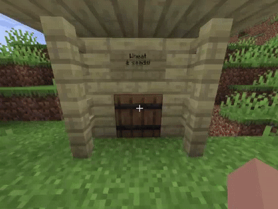
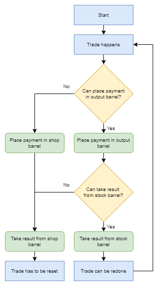
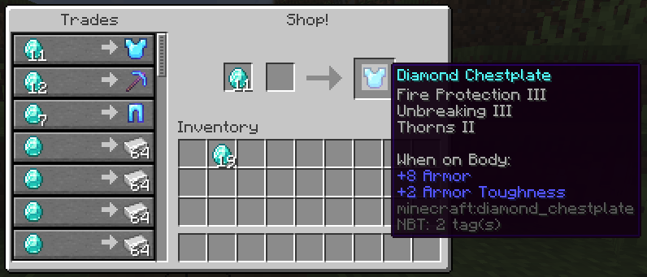
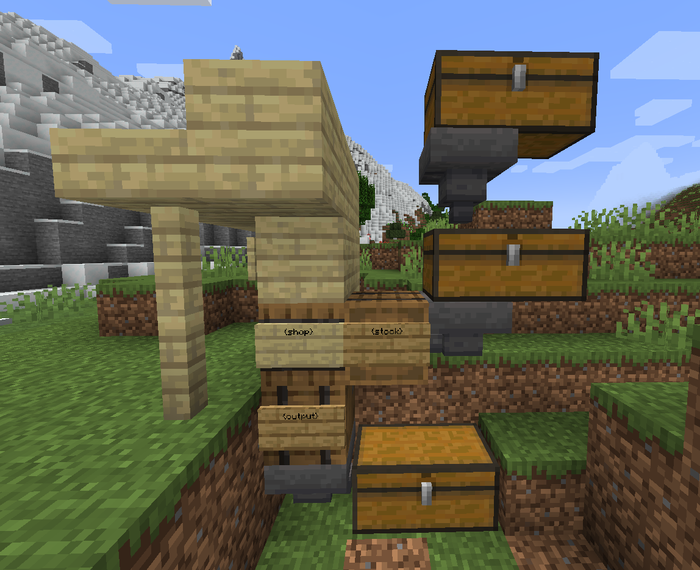

# Player trading, for Metacraft

## Important
Make sure to run `gradlew runDatagen` before compiling, otherwise the crafting recipe won't work!

## Disclaimer, this readme is outdated!

Set up player shops/trading stations with just barrels and signs!
Server side only, 1.18.1 with Fabric loader.

## Getting started
All you need to set up a trading station is a Barrel and a Sign.  
Simply place down the Barrel, and attach a Sign to it. On the sign you should write "{shop}". Now right-click the sign, and you should get a confirmation that the shop is created! (The sign can be removed after, but can also be used to troubleshoot your trades).  

You, the owner, can access the barrel as normal in order to set up the trades. Any other player accessing the Barrel will be greeted with a villager-like interface showing your trades!  

The barrels inventory is divided into 9 sections (here highlighted in pink), with three slots each. These slots represent the first payment, the second payment, and the result of the trade.  

Place the amount of items(s) you wish to recieve in the first and second slots. The second one can be empty, if you only want one type of item as payment. In the last slot you place the item you are selling. You can preview the trades (or trade with yourself) by sneaking and opening the barrel!

When a trade is completed the result of the trade (slot 3) will be given to the customer, and removed from the barrel. The payment items(s) will be merged with those already in the barrel.  

This simple setup has some limitations, which can be overcome with extensions that will be covered shortly  
1. You can not take unstackable items as payment, since the payment needs to be able to be merged with the item you already have in the barrel to define the trade
2. For the same reason, you can not take a stack larger than the max stack size / 2 as payment.
3. The trade is one time use, before you have to set it up again. Perfect for selling armor pieces or enchanted books, but not so great for selling your huge stacks of iron.  

## Extension barrel: Output
A output barrel can be placed next to your shop barrel to receive the payment items, instead of them stacking into the shop barrel.  
Place a barrel somewhere next to the shop barrel. Attach a sign, write "{output}" on it, and right-click the sign. You now have a output barrel! If you have the shop sign attached to the shop barrel (you can place a new one), you can right-click it to verify that the shop sees the output barrel.  

Now when a trade is completed, the payment items you recive from the customer will be placed in the output chest if space is available. This solves limitations 1 and 2, so with a output barrel you can set up trades for unstackable items or large stacks.

Feel free to pipe out items from the output chest using hoppers to even larger chests!

## Extension barrel: Stock
A stock barrel can be placed next to your shop barrel to supply the traded items, instead of it being taken from the shop barrel.  
Place a barrel somewhere next to the shop barrel. Attach a sign, write "{stock}" on it, and right-click the sign. You now have a stock barrel!

Now when a trade is completed, the resulting items your customer recives from the trade will be taken from the stock chest if possible. This solves limitations 3, so now you can set up recuring trades selling of large quantities of items!

Feel free to pipe items into the barrel from even more storage chests using hoppers!

Note that the stock barrel will only be used if a output barrel is used as well, and the resulting items from each trade can be placed in the output barrel. Otherwise the payment items would be placed in the shop barrel, and the price would be doubled with each trade...

The following flowcharts shows the decision process

## Extension barrel: Storage
Sign tag: "{storage}"  
A storage barrel acts like a stock barrel and a output barrel at the same time!
Perfect for trading items forwards and backwards, for bank systems or for profit.
The storage barrel is checked to have both a valid place to put the payment, and have stock items. If it gets too full the trade might not work. Be sure to keep it balanced.

## Alternative shop: Permanent shop
Sign tag: "{permanent shop}"  
Tired of your trades dissapearing because someone took the last stock from the shop barrel? This one is for you.
The Permanent shop barrel refuses to perform the last trade that would break the trade setup.

This shop type requires a output + stock or a storage barrel to be usefull.

## Alternative shop: Admin shop
Sign tag: "{admin shop}"  
Requires OP permissions to use  
This shop type has a magical infinite supply of items. It tries to put payments in a output barrel if connected, but otherwise it is perfectly happy to void them.
Usefull for admin controlled shops.

## Alternative shop: Single use admin shop
Sign tag: "{single use}"  
Requires OP permissions to use  
Similar to a Admin shop, but clears the trade after a single use, and does not keep any payments.   
If the last trade is used up, the barrel self destructs! (non explosive).
Usefull for setting up single use trades in many locations, for example for selling land plots.

## Shop keys
Setting up shops with your friends? Shop keys are just what you need!
Right-click any of your shops with a gold ingot to create a shop key. 
Anyone with your key will be able to open and edit your shops.

## Admin debug stick
Users with OP permissions can use the command `/shop debug` to get hold of a debug stick.  
With a debug stick in hand a OP user can look into any shop and access troubleshooting information on shop signs, just as the owner would.

## Pictures

### A simple trade station for some armor and iron  

### A large scale trade setup, perhaps connected to a automatic farm?  

## Protection
This mod does not provide any sort of protection on the barrels, as that would be way out of scope. Even if other players can not access the shop barrel inventory, they can still break the block. 
But the mod should work fine along any other mod providing block protection.
