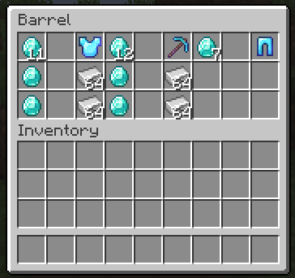

# Player trading, for Metacraft
Set up player shops/trading stations with just barrels and signs!
Server side only, 1.18.1 with Fabric loader.

## Getting started
All you need to set up a trading station is a Barrel and a Sign.  
Simply place down the Barrel, and attach a Sign to it. On the sign you should write "{shop}". Now right-click the sign, and you should get a confirmation that the shop is created! (The sign can be removed after, but can also be used to troubleshoot your trades).  

You, the owner, can access the barrel as normal in order to set up the trades. Any other player accessing the Barrel will be greeted with a villager-like interface showing your trades!  

The barrels inventory is divided into 9 sections (here highlighted in pink), with three slots each. These slots represent the first payment, the second payment, and the result of the trade.  

Place the amount of items(s) you wish to recieve in the first and second slots. The second one can be empty, if you only want one type of item as payment. In the last slot you place the item you are selling. You can preview the trades (or trade with yourself) by sneaking and opening the barrel!

When a trade is completed the result of the trade (slot 3) will be given to the customer, and removed from the barrel. The payment items(s) will be merged with those already in the barrel.  

This simple setup has some limitations, which can be overcome with extensions that will be covered shortly  
1. You can not take unstackable items as payment, since the payment needs to be able to be merged with the item you already have in the barrel to define the trade
2. For the same reason, you can not take a stack larger than the max stack size / 2 as payment.
3. The trade is one time use, before you have to set it up again. Perfect for selling armor pieces or enchanted books, but not so great for selling your huge stacks of iron.  

## Extension barrel: Output
A output barrel can be placed next to your shop barrel to receive the payment items, instead of them stacking into the shop barrel.  
Place a barrel somewhere next to the shop barrel. Attach a sign, write "{output}" on it, and right-click the sign. You now have a output barrel! If you have the shop sign attached to the shop barrel (you can place a new one), you can right-click it to verify that the shop sees the output barrel.  

Now when a trade is completed, the payment items you recive from the customer will be placed in the output chest if space is available. This solves limitations 1 and 2, so with a output barrel you can set up trades for unstackable items or large stacks.

Feel free to pipe out items from the output chest using hoppers to even larger chests!

## Extension barrel: Stock
A stock barrel can be placed next to your shop barrel to supply the traded items, instead of it being taken from the shop barrel.  
Place a barrel somewhere next to the shop barrel. Attach a sign, write "{stock}" on it, and right-click the sign. You now have a stock barrel!

Now when a trade is completed, the resulting items your customer recives from the trade will be taken from the stock chest if possible. This solves limitations 3, so now you can set up recuring trades selling of large quantities of items!

Feel free to pipe items into the barrel from even more storage chests using hoppers!

Note that the stock barrel will only be used if a output barrel is used as well, and the resulting items from each trade can be placed in the output barrel. Otherwise the payment items would be placed in the shop barrel, and the price would be doubled with each trade...

The following flowcharts shows the decision process

## Pictures

### A simple trade station for some armor and iron  

### A large scale trade setup, perhaps connected to a automatic farm?  

## Protection
This mod does not provide any sort of protection on the barrels, as that would be way out of scope. Even if other players can not access the shop barrel inventory, they can still break the block. 
But the mod should work fine along any other mod providing block protection.
